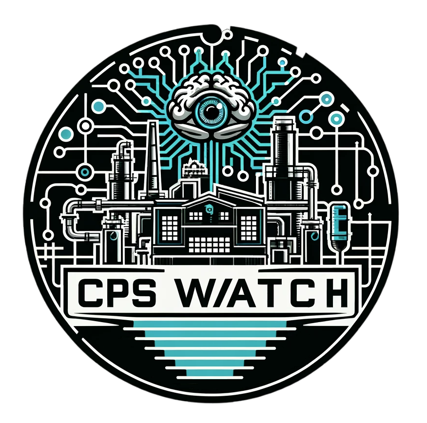

# CPSWatch
**Repository for the "CPSWatch" ontology.**

This ontology defines a vocabulary for describing cyber physical systems for monitoring purpose. It contains two main concepts: **CPSWatch#MonitoredSystem** that is a top level description of a System that is modeled and **CPSWatch#MonitoringSensor** that is a top level description of a sensor used to monitor the CPSWatch#MonitoredSystem.
